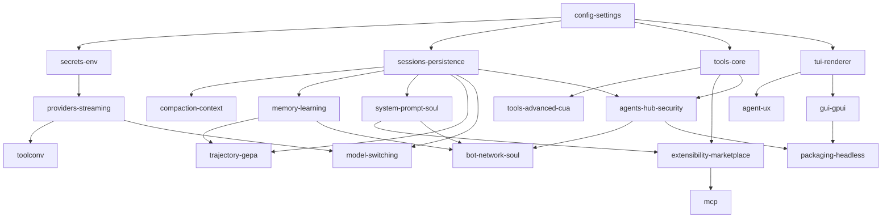

# Research Map — titi: слияние трёх харнессов на Rust

titi = клон харнесса **omp** (весь функционал) + **обучаемость Hermes Agent** (память, SOUL, self-improvement) + **мультиботность и безопасность Vellum** (сеть ботов, actor identity). Реализация — Rust workspace.

## Активный порт reference product

Текущее направление разработки — функциональная модель reference product с единым Rust engine и нативным GPUI desktop. Канонические документы для продолжения любой моделью:

- [решения, архитектура и milestones](reference-product-port/README.md);
- [текущий checkpoint, проверки, риски и NEXT](reference-product-port/STATE.md).

## Темы (20)

| # | Slug | Тема | Статус |
|---|------|------|--------|
| 1 | [config-settings](config-settings/README.md) | Конфиг и settings: слоёная резолюция, deep-merge, профили | STATE.md |
| 2 | [secrets-env](secrets-env/README.md) | Секреты, .env, auth store, креды вне модели | STATE.md |
| 3 | [sessions-persistence](sessions-persistence/README.md) | Сессии, дерево/форк/resume, SQLite+FTS | STATE.md |
| 4 | [compaction-context](compaction-context/README.md) | Компакция, context-files, prewalk | STATE.md |
| 5 | [system-prompt-soul](system-prompt-soul/README.md) | Системный промпт, SOUL.md slot #1 | STATE.md |
| 6 | [memory-learning](memory-learning/README.md) | Память (bounded stores, FTS, journey) | STATE.md |
| 7 | [trajectory-gepa](trajectory-gepa/README.md) | Trajectory capture + GEPA self-improvement | STATE.md |
| 8 | [providers-streaming](providers-streaming/README.md) | Провайдеры, SSE-стриминг, retry/fallback | STATE.md |
| 9 | [toolconv](toolconv/README.md) | Tool-call конверсия форматов моделей | STATE.md |
| 10 | [tools-core](tools-core/README.md) | read/edit/write/bash/glob/grep | STATE.md |
| 11 | [tools-advanced-cua](tools-advanced-cua/README.md) | eval/notebook/web/browser + CUA-драйвер | STATE.md |
| 12 | [model-switching](model-switching/README.md) | Смена модели mid-session | STATE.md |
| 13 | [tui-renderer](tui-renderer/README.md) | TUI-движок: history/viewport/overlay | STATE.md |
| 14 | [agent-ux](agent-ux/README.md) | Композер, slash, overlay, transcript | STATE.md |
| 15 | [extensibility-marketplace](extensibility-marketplace/README.md) | Extensions, skills, rulebook, marketplace | STATE.md |
| 16 | [mcp](mcp/README.md) | MCP клиент/сервер | STATE.md |
| 17 | [agents-hub-security](agents-hub-security/README.md) | Subagents, hub, checkpoint, actor identity | STATE.md |
| 18 | [bot-network-soul](bot-network-soul/README.md) | Сеть ботов, SOUL, обмен опытом, каналы | STATE.md |
| 19 | [gui-gpui](gui-gpui/README.md) | GUI (gpui) поверх общего ядра | STATE.md |
| 20 | [packaging-headless](packaging-headless/README.md) | CLI, установка, RPC/SDK/collab | STATE.md |

Статусы ведутся в [STATE.md](STATE.md) — единая точка возобновления.

## Граф зависимостей тем

Топологический порядок реализации: config-settings, secrets-env → sessions-persistence, providers-streaming → … (см. PLAN.md).

## Как читать тему

Каждая тема: функционал всех трёх харнессов → решение «одно/комбо» → Rust-маппинг (крейты, трейты) → Definition of Done → Deep-dive (подсистемы 2-го уровня в подпапках).
