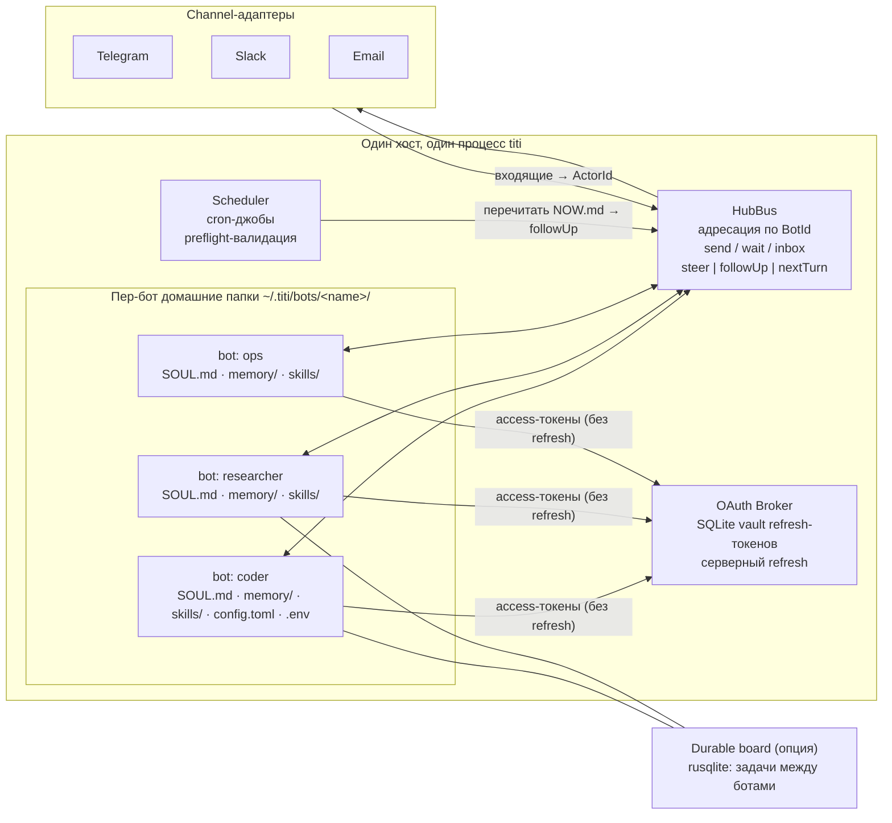

# Сеть ботов и SOUL

Тема: пер-бот домашняя папка (SOUL + memory + skills изоляция, профили), bot-to-bot коммуникация через hub-каналы, обмен опытом (перенос memory/skills), экспорт/импорт «души» бота (пак SOUL+skills+memory), проактивность (cron-перечитывание заметок, уведомления без прерывания диалога), каналы (Telegram/Slack/Email), OAuth.

## omp

omp не имеет понятия «постоянный бот с домашней папкой» — его мир это сессия + подагенты. Но механики, из которых собирается сеть ботов, там есть:

1. **Agent Hub и peer-обмен** (`omp://agent-hub.md`): реестр агентов сессии со статусами `running/idle/parked/aborted`; агент-агентные сообщения — `hub send` (fire-and-forget, будит idle/parked пира), `hub wait`, `hub list`; parked-агент оживляет при получении сообщения; транскрипты — `history://<id>`, финальный вывод — `agent://<id>`. Это готовая модель «бот-канала»: адресация по имени, доставка без блокировки, revive по входящему.
2. **Семантика доставки сообщений** (`omp://extensions.md`): `pi.sendMessage(msg, { deliverAs: "steer" | "followUp" | "nextTurn", triggerTurn })` — steer прерывает текущий прогон, followUp встаёт в очередь после него, nextTurn инъецируется в следующий ход. Это прямой ответ на требование «уведомления без прерывания диалога»: проактивное событие = `deliverAs: "followUp"`, важное = `steer`. Там же — `ctx.setInterval/setTimeout` (managed-таймеры с изоляцией падений и автоочисткой на `session_shutdown`) как каркас проактивности, и пример `mcp_notification` → `pi.sendUserMessage(..., deliverAs: "steer")` как мост внешний push → сессия.
3. **Collab как hub-топология** (`omp://collab.md`): хост авторитарен, гости не пирят; AES-256-GCM end-to-end шифрование до релея, релей видит только room id и шифротекст; доступ закодирован в самой ссылке (48-байтный full-ключ = 32 байта AES-ключ + 16-байт write-token, view-only = только ключ). Полезная модель доверия для bot-to-bot: «владение ссылкой/токеном = уровень прав».
4. **OAuth и секреты** (`omp://auth-broker-gateway.md`, `omp://secrets.md`): `omp auth-broker serve` держит канонический SQLite-vault refresh-токенов, клиенты получают redacted-снапшот (`REMOTE_REFRESH_SENTINEL` вместо refresh-токенов), refresh выполняется серверно через `POST /v1/credential/:id/refresh`; снапшот-кэш шифруется AES-256-GCM ключом от bearer-токена. Секреты, всё же попавшие в контекст, обфусцируются обратимыми плейсхолдерами `$$FRIENDLY_HASH:L$$` (HMAC под пер-инсталляционным ключом `~/.omp/agent/secret-placeholder.key`), env-переменные с паттернами `TOKEN/OAUTH/SECRET/...` собираются автоматически.
5. **Честно: не покрывает.** Пер-бот домашняя папка/профили у omp отсутствуют; ближайшие аналоги — `~/.omp/agent/` (keybindings, secrets.yml глобального уровня) и per-project `<cwd>/.omp/secrets.yml` (`omp://secrets.md`), плюс скоупинг состояния подагентов в дереве артефактов сессии (`omp://agent-hub.md`). «Души» (SOUL-файла) у omp нет; ближайший аналог — системный промпт и сессионное состояние.

## Hermes

Hermes — прямой носитель всех ключевых механик темы:

1. **Профили = пер-бот домашняя папка** (https://hermes-agent.nousresearch.com/docs/user-guide/profiles): профиль — отдельный Hermes home (`~/.hermes/profiles/<name>/`) со своим `config.yaml`, `.env`, `SOUL.md`, памятью, сессиями, skills, cron-джобами и state-БД; реализовано через `HERMES_HOME` (все 119+ файлов путей идут через `get_hermes_home()`). `hermes profile create coder --clone` копирует конфиг+SOUL+skills, `--clone-all` — всё включая память и кроны (история сессий исключается). Два процесса на один профиль запрещены документацией — общая память для нескольких ботов делается внешним memory-provider'ом (Honcho). Профиль как «душа»: `hermes profile export coder` пакует `.tar.gz` (skills, memory, persona, crons, plugins; **ключи вырезаются**), `hermes profile import coder.tar.gz --name coder` разворачивает; есть дистрибуция через git-репозиторий (`profile install github.com/you/research-bot --alias`, `profile update` — обновления сохраняют локальные memory и `.env`).
2. **SOUL.md — идентичность** (https://hermes-agent.nousresearch.com/docs/user-guide/features/personality): `SOUL.md` занимает slot #1 системного промпта, загружается только из `HERMES_HOME` (никогда из cwd — личность не «течёт» между проектами), прогоняется через prompt-injection сканирование и обрезку, пустой/нечитаемый файл → fallback на дефолтную личность; существующий пользовательский файл никогда не перезаписывается. Сессионные оверлеи — `/personality <name>`, кастомные личности — `agent.personalities` в `config.yaml`.
3. **Каналы и гейтвеи** (https://hermes-agent.nousresearch.com/docs/user-guide/profiles, раздел «Running gateways»): у каждого профиля свой процесс-гейтвей со своим bot-токеном (Telegram, Discord, Slack, WhatsApp, Signal) из своего `.env`; token-lock — второй профиль с тем же токеном блокируется с ошибкой, называющей конфликтующий профиль; `gateway install` создаёт per-profile systemd/launchd-сервис (`hermes-gateway-coder`), в Docker — s6-слот `/run/service/gateway-<name>/`.
4. **Проактивность** (https://hermes-agent.nousresearch.com/docs/user-guide/features/cron): единый инструмент `cronjob` (create/pause/resume/edit/trigger/remove), natural-language расписания, результаты доставляются «back to the origin chat, local files, or configured platform targets»; no-agent mode (скрипт по расписанию без LLM); preflight-валидация (битая конфигурация → `blocked_config`, один алерт, ноль LLM-вызовов); cron-сессии не могут создавать кроны (защита от runaway).
5. **Bot-to-bot** (https://hermes-agent.nousresearch.com/docs/user-guide/features/kanban): канбан-доска `~/.hermes/kanban.db` (SQLite) поверх профилей — «durable message queue + state machine», каждый воркер — полный OS-процесс со своим именем и постоянной памятью; агентное API — тулсет `kanban_*` (`kanban_create/list/complete/block/comment/heartbeat/...`), координация peer-to-peer: любой профиль читает/пишет любую задачу; диспетчер в гейтвее (тик 60 c), статусная машина `triage|todo|ready|running|blocked|review|done|archived`; комментарий — межагентный протокол (воркер при спавне читает всю тред-историю).

## Vellum

По `local://vellum-summary.md` (2026):

1. **SOUL как живой файл**: поведение живёт в `SOUL.md`; при онбординге ассистент наблюдает, как пользователь общается, и **сам пишет свои файлы личности**; ведёт per-user журнал размышлений (reflections) и `NOW.md` — скретчпад текущего фокуса и активных нитей. Это ключ к «обмену опытом»: душа — не статичный конфиг, а артефакт, который бот дописывает сам.
2. **Проактивность**: каждый час ассистент перечитывает свои заметки, ищет незавершённое/скоро наступающее и пишет, если что-то требует внимания; уведомления идут **в правильный канал и не прерывают активный диалог**.
3. **Каналы**: macOS, iOS, Web, Voice, Email, Telegram, Slack, Twilio — «один ассистент, одна память, каждый канал» (каналы не фрагментируют личность и память).
4. **OAuth**: Slack, Notion, Google, HubSpot, Linear, Discord, Twitter, Telegram, Twilio — «без самописного token refresh» (refresh полностью на платформе).
5. **Память и изоляция**: 8 типов памяти (episodic, semantic, procedural, emotional, prospective, behavioral, narrative, shared) со своими staleness-окнами; гибридный dense+sparse retrieval; изоляция per-user и per-channel; эмбеддинги локально по умолчанию.
6. **Безопасность сети**: actor identity (guardian/trusted/unknown) резолвится один раз и соблюдается всюду; unknown не может читать память, триггерить инструменты или эскалировать; креденшелы в отдельном процессе, каждый вызов инструмента в песочнице, по умолчанию deny.

## Решение (одно/комбо)

**Комбо: Hermes-профили как каркас изоляции + omp hub-семантика как транспорт + Vellum-проактивность и живой SOUL.** Пер-бот домашняя папка берётся у Hermes (`~/.titi/bots/<name>/` со своим `SOUL.md`, memory, skills, config, `.env`) — это проверенная модель `HERMES_HOME`, дешёвая (одна env-переменная/один root-путь) и безопасная (два писателя на одну папку запрещены). Bot-to-bot коммуникация — omp-модель hub-каналов: адресация по имени, fire-and-forget `send`, семантика доставки `steer/followUp/nextTurn` для уведомлений без прерывания диалога, revive при входящем сообщении — это точнее отвечает на «эффективность» (никаких постоянных соединений и поллинга между ботами), чем канбан-Hermes; канбан-очередь берём как опциональный durable-слой для долгих задач между ботами. Проактивность — Vellum-модель: cron-джоба перечитывает `NOW.md`/заметки, вывод маршрутизируется в правильный канал с `deliverAs: followUp`. Экспорт/импорт души — Hermes-модель `profile export/import` (тарбол SOUL+skills+memory с вырезанными ключами) плюс git-дистрибуция для версионированных обновлений. OAuth — паттерн omp auth-broker: централизованный vault refresh-токенов, ботам выдаются только access-снапшоты, refresh серверный; поверх — Vellum-принцип «никакого самописного refresh».

Схема мультиботной топологии titi:



## Rust-маппинг

**Крейты workspace:**

- `titi-core` — идентичность и домен: `BotId`, `ActorId` (guardian/trusted/unknown), `Soul`, `MemoryStore`, `Skill`.
- `titi-bots` (новый) — пер-бот домашние папки, реестр ботов, hub-шина, экспорт/импорт паков, board (durable-очередь).
- `titi-channels` (новый) — адаптеры Telegram/Slack/Email, маршрутизация входящих в hub и исходящих из ботов.
- `titi-scheduler` (новый, либо в `titi-bots`) — cron, preflight, доставка проактивных уведомлений.
- `titi-providers` — LLM-провайдеры + OAuth-клиент к брокеру (только access-снапшоты).
- `titi-tools`, `titi-tui`, `titi-cli` — тулсет ботов, ростер/инспектор сети в TUI, `titi bots create/export/import` CLI.

**Ключевые типы (эскизы):**

```rust
// titi-core
pub struct BotId(pub Arc<str>);

pub enum Actor { Guardian, Trusted(BotId), Unknown }

pub struct Soul { pub system: String, pub now_md: String } // slot #1 промпта; скретчпад

#[async_trait::async_trait]
pub trait MemoryStore: Send + Sync {
    async fn write(&self, bot: &BotId, scope: MemoryScope, entry: MemoryEntry) -> anyhow::Result<()>;
    async fn search(&self, bot: &BotId, scope: MemoryScope, q: &str) -> anyhow::Result<Vec<MemoryEntry>>;
    async fn snapshot(&self, bot: &BotId) -> anyhow::Result<MemorySnapshot>; // для обмена опытом / экспорта
}

// titi-bots: hub-канал (omp-семантика)
pub enum Delivery { Steer, FollowUp, NextTurn }

pub struct Envelope { pub from: BotId, pub to: BotId, pub body: String, pub delivery: Delivery }

#[async_trait::async_trait]
pub trait HubBus: Send + Sync {
    async fn send(&self, env: Envelope) -> anyhow::Result<()>;          // fire-and-forget, будит idle-бота
    async fn inbox(&self, bot: &BotId) -> Vec<Envelope>;
    async fn wait(&self, bot: &BotId, timeout: Duration) -> Option<Envelope>;
}

// тит-боты: домашняя папка и «душа»
pub struct BotHome { pub root: PathBuf } // ~/.titi/bots/<name>/{SOUL.md, memory/, skills/, config.toml, .env}
impl BotHome {
    pub fn open(name: &str) -> anyhow::Result<Self>;                     // единственный писатель: file-lock
    pub fn soul(&self) -> anyhow::Result<Soul>;
    pub async fn export_pack(&self, dest: &Path) -> anyhow::Result<()>;  // tar.gz SOUL+skills+memory, ключи вырезаны
    pub async fn import_pack(&self, src: &Path) -> anyhow::Result<()>;
}

// titi-channels
#[async_trait::async_trait]
pub trait ChannelAdapter: Send + Sync {
    fn kind(&self) -> ChannelKind;                                        // Telegram | Slack | Email
    async fn run(&self, tx: mpsc::Sender<Inbound>);                       // входящие → hub (с ActorId)
    async fn notify(&self, to: &ChannelTarget, msg: &str) -> anyhow::Result<()>; // проактивные уведомления
}
```

**Внешние крейты:** `tokio` (runtime, mpsc), `serde`/`toml` (config.toml), `rusqlite` (memory + durable board + OAuth vault), `tar` + `flate2` (паки души), `aes-gcm` (шифрование кэша снапшотов/паков, как в omp), `frankenstein` или `teloxide` (Telegram long-polling без тяжёлого фреймворка — эффективнее), `slack-morphism` (Slack), `lettre` (Email SMTP/IMAP), `oauth2` + `reqwest` (поток OAuth к брокеру), `croner` или `tokio-cron-scheduler` (cron), `fs2`/`fd-lock` (пер-бот file-lock против двух писателей), `tracing` (логи по `BotId`).

## Definition of Done

- [ ] `titi bots create <name>` создаёт `~/.titi/bots/<name>/` с `SOUL.md`, `memory/`, `skills/`, `config.toml`, `.env`; повторное создание с существующим именем — ошибка; открытая папка защищена file-lock (второй процесс — ошибка с именем владельца, как Hermes token-lock).
- [ ] `SOUL.md` бота попадает slot #1 системного промпта, загружается только из домашней папки бота (не из cwd), пустой/нечитаемый → дефолтная личность; юнит-тест на все три ветки.
- [ ] `titi bot send --to researcher "..."` доставляет конверт в hub-шину; idle-бот просыпается, доставка `followUp` не прерывает идущий прогон (интеграционный тест: steer-сообщение появляется в текущем ходе, followUp — после его завершения).
- [ ] Cron-джоба бота по расписанию перечитывает `NOW.md` и отправляет результат через `Delivery::FollowUp` в заданный канал; битая конфигурация джобы даёт один алерт и ноль LLM-вызовов (preflight, тест на mock-провайдере).
- [ ] `titi bots export coder --out coder.titi.tar.gz` пакует SOUL+skills+memory без содержимого `.env` (тест: grep по распакованному архиву не находит ни одного значения ключей); `titi bots import` разворачивает пак под новым именем.
- [ ] Входящие сообщения из Telegram/Slack/Email резолвятся в `Actor::Guardian|Trusted|Unknown`; unknown-актор получает отказ на чтение памяти и вызов инструментов (тест).
- [ ] Access-токены приходят ботам из OAuth-брокера в виде redacted-снапшота; refresh выполняется только брокером; секреты, попавшие в контекст, обфусцируются плейсхолдерами (тест на обфускатор).
- [ ] TUI показывает ростер сети ботов (статус, непрочитанные, последний акт) — минимум по интеграционному снимку состояния шины.

## Deep-dive

Подсистемы-доки (2-й уровень, план — писать по мере проработки):

- `docs/research/bot-network-soul/bot-home-isolation.md` — пер-бот папка: layout, file-lock, HERMES_HOME-модель, общая память через внешний провайдер.
- `docs/research/bot-network-soul/hub-channels.md` — hub-шина: конверты, steer/followUp/nextTurn, revive, канал из канбана (durable-очередь) vs in-memory.
- `docs/research/bot-network-soul/experience-transfer.md` — обмен опытом: memory-снапшоты между ботами, перенос skills, dedup, staleness-окна Vellum.
- `docs/research/bot-network-soul/soul-pack.md` — экспорт/импорт души: формат тарбола, вырезание секретов, git-дистрибуция и update-семантика.
- `docs/research/bot-network-soul/proactivity.md` — планировщик: cron-выражения, preflight, no-agent mode, доставка без прерывания.
- `docs/research/bot-network-soul/channel-adapters.md` — Telegram/Slack/Email: long-polling vs webhook, routing, per-channel memory-scope.
- `docs/research/bot-network-soul/oauth-broker.md` — OAuth: vault, серверный refresh, account pools, обфускация секретов.
